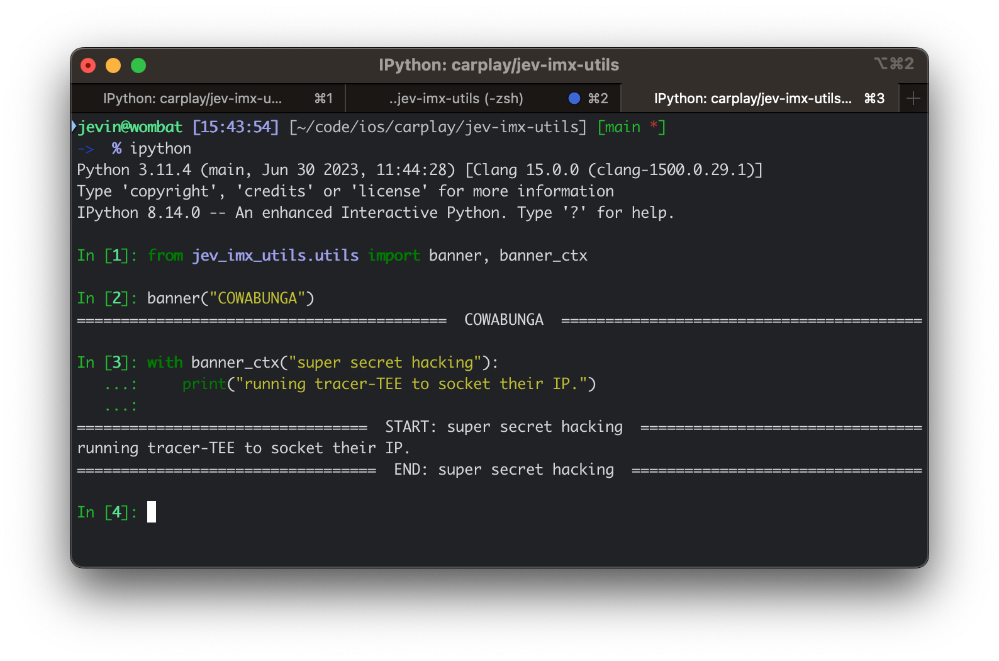

# jev-imx-utils
Utilities for NXP iMX SoCs

## Etc.
I got distracted and wanted some fancy banner delimiters.
In `jev_imx_utils.utils` module you can find the `banner` function and `banner_ctx` context manager.

Example usage:

